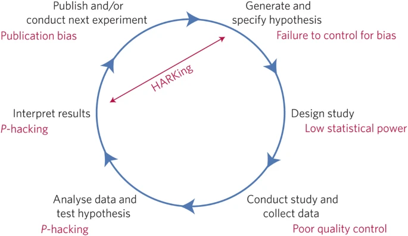
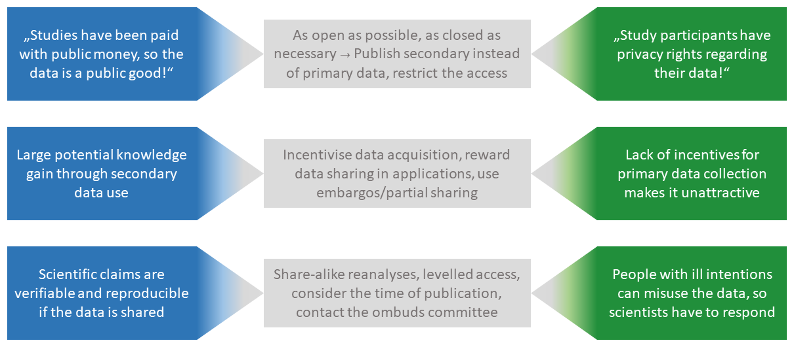
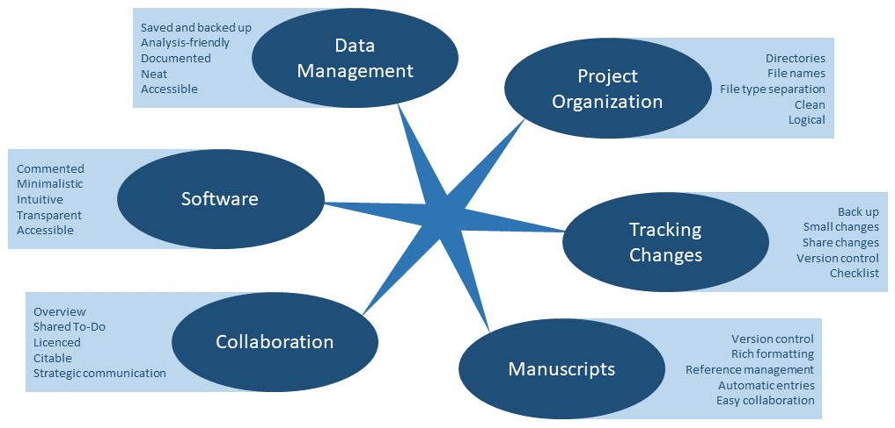
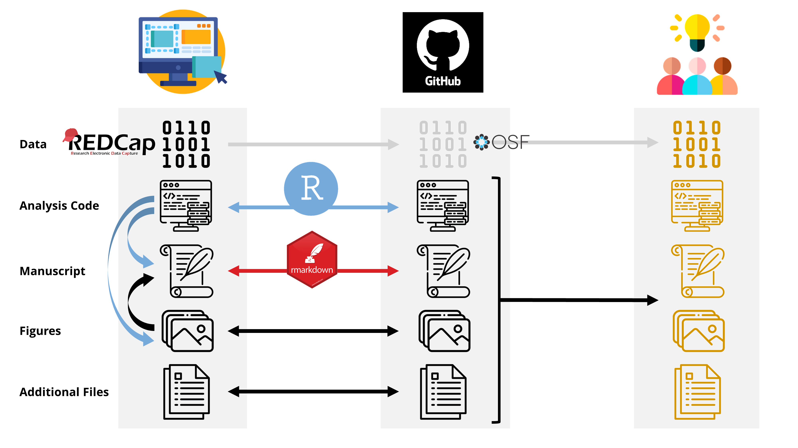
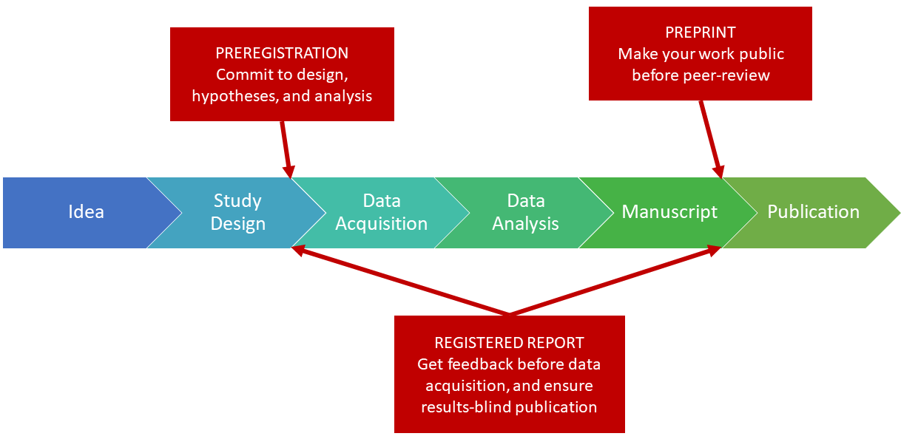
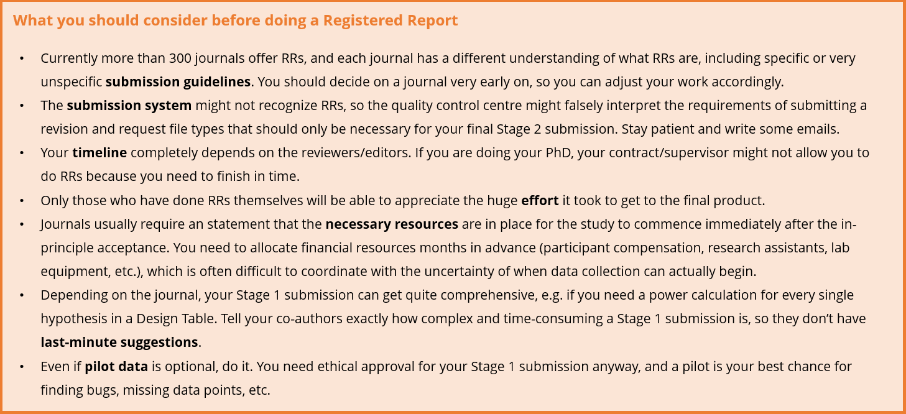
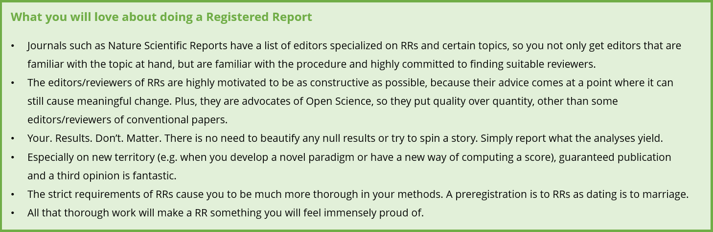

# Handbook for the Open Science course of the MGK CRC940

## Chapters

- [Introduction](#introduction)
- [Open Science](#open-science)
- [Open Access](#open-access)
- [Open Data, Materials, and Code](#open-data-materials-and-code)
- [Reproducible Analysis](#reproducible-analysis)
- [Preregistration and Registered Reports](#preregistration-and-registered-reports)
- [Replication Research](#replication-research)

---

# Introduction

The structure of this workshop is loosely based on [Seven easy steps to Open Science: An annotated reading list](https://doi.org/10.1027/2151-2604/a000387) by Crüwell et al. (2019).

It is a very good overview of the different aspects that we will cover, and you will find the papers they refer to in the subsections of this course.

You are free to read the Crüwell paper as an introduction or dive right into the subsections. You can even save it for last, as a course summary if you will.

The subsections [Open Science](#open-science), [Open Access](#open-access), [Open Data, Materials, and Code](#open-data-materials-and-code), [Reproducible Analysis](#reproducible-analysis), and [Preregistration](#preregistration) are compulsory course elements, while [Replication Research](#replication-research) is an optional subsection for you to look into if you are interested. We deliberately left out the seventh step, Teaching, in order to make space for the other issues that are more relevant to you right know.

---

# Open Science

Open Science

A good introduction to Open Science gives the paper by Munafó et al. (2017): [A manifesto for open and reproducible science](https://doi.org/10.1038/s41562-016-0021).

The illustration below (taken from the paper by Munafó et al.) illustrates the concept of Open Science well. It shows the deductive scientifc process and - in red - the threats to the quality of this process. Open Science aims to eliminate these threats, thereby ensuring scientific quality. The cyclic character of the illustration already gives you an idea of one of the most challenging aspects of Open Science: It won't be enough to tackle single threats one by one, you need to address them all. Luckily, many Open Science practises such as preregistration address multiple threats at the same time. And yet, preregistration is one of the practises that is quite easy to implement because it is all in your hands and no one can stop you. Practises that address publication bias are harder to implement because we are still very dependent on publishers for getting our peer-reviewed papers out in the world.

You will get to know the most important Open Science practises throughout this course, so you can get a more in-depth understanding of the motivation behind each practise, tips and resources for how to implement them, and future challenges that have yet to be solved.

Further resources that you can refer to as needed:

- The Open Science Initiative of the faculty of psychology (OSIP) offers monthly meetings, information, and discussion. Sign up [here](https://tu-dresden.de/mn/psychologie/die-fakultaet/open-science?set_language=en).
- Simine Vizire wrote an article in 2018 about the implications of the credibility revolution. It is a good introduction to Open Science, as she paints the bigger picture of how those seemingly disadvantageous practices benefit science in the long run. Read it [here](https://doi.org/10.1177/1745691617751884).
- Mallory Kidwell and colleagues wrote a paper in 2016 about how much the badge system of Psychological Science has been contributing to the prevalence and quality of open data. Read it [here](https://doi.org/10.1371/journal.pbio.1002456).
- Slides and audio recordings for an introduction workshop on open science by Xenia Schmalz can be found [here](https://osf.io/7sxkg) (why do we need open science, registered reports and preregistration, open research workflow with the open science framework, accessing papers, FAIR data, open science in action).

---

# Open Access

This paper by Jon Tennant et al. (2016) on [The academic, economic and societal impact of Open Science](https://doi.org/10.12688/f1000research.8460.3) provides great insight into the current scientific system. Don't be discouraged, almost two thirds of it are references and appendices.

Open access refers to the strive of making scientific knowledge freely available to anyone, without paywalls or regional restrictions. Thanks to expensive contracts between SLUB and publishing houses, you as a member of the TUD have access to a large portion of journal articles out there. But you have probably also been in a situation yourself, where you were in the middle of a literature search and had a highly interesting abstract in front of you, only to see that the full pdf can be purchased for the slim price of 35.99$. In some cases, authors cannot even freely access the final typesetted version of *their own* paper.

The current, very flawed system looks like this:

The system is changing thanks to a lot of pressure by activists of the scientific community, but it is changing slowly, and many established and new journals are trying to profit from this change by simply charging fees at a different step in the process under a different name.

There are different types or 'routes' of open access publishing. There is the Gold Open Access model, where you (or hopefully your institution) pay an article processing charge (APC) to the journal in order to make it freely available to the public. The APC can range from 2,000$ to 10,000$ depending on the impact factor and lack of guilty conscience of the journal. And keep in mind that this only to make your article open access, your institution still has to pay to access all the other non-open-access articles that have been published in the past. And then there is the Green Open Access model, where you upload the final article in a repository in order to make it freely available to the public after a certain amount of time, usually six months.

The three graphics were taken from [here](https://open-access.net/en/information-on-open-access/open-access-strategies).

Further resources that you can refer to as needed:

- The SLUB is currently developing an Open Access search engine called [B!SON](https://service.tib.eu/bison/), which aims to recommend suitable journals based on the input of title, abstract, and references of your manuscript.
- An overwhelmingly long sitemap of resources can be found on the Open Access information platform [here](https://open-access.network/en/translate-to-english-sitemap). Choose between the history of Open Access, repositories, Open Access for different types of media, positions on Open Access, legal issues in different countries, etc.

---

# Open Data, Materials, and Code

This paper by Olivier Klein et al. (2018), titled [A practical guide for transparency in psychological science](
https://doi.org/10.1525/collabra.158), does exactly what it says.

Sharing your data (and your analysis scripts) openly in safe repositories is not only intended to enable the reproduction of your analyses but also the aggregation of data sets from all over the world for powerful meta-analyses. However, many researchers are hesitant when it comes to open data because they are concerned about copyright issues, having missed a mistake of their own, accidental violations of privacy, etc. It is important to address these concerns in order to move forward with the open data movement.

This figure is adapted from the talk by Felix Schönbrodt (see below) and represents some of the core concerns and values that need to be balanced in the open data movement, with possible solutions/tips in the grey box inbetween:

Further resources that you can refer to as needed:

- This compact article by the University of Calgary briefly describes what each licence type means, read it [here](https://libanswers.ucalgary.ca/faq/200582).
- This tool takes you through your goals step by step to find the licence type that is right for you. Find it [here](https://chooser-beta.creativecommons.org/).
- This website by the Open Knowledge Foundation provides a compact framework of Open Data. You can navigate to different steps in the Open Data research process using the hamburger in the upper left corner. It also contains a nifty glossary of all the terms associated with Open Data. Find it [here](http://opendatahandbook.org/guide/en/introduction/).
- This website allows you to search for a repository that suits your needs. You can filter by subject, country, licenses, restrictions, standards, etc. Find it [here](https://www.re3data.org/).
- This checklist gives you an idea of whether your data conforms to the FAIR principles [here](https://satifyd.dans.knaw.nl/).

---

# Reproducible Analysis

The paper [Good enough practises in scientific computing](https://doi.org/10.1371/journal.pcbi.1005510) by Greg Wilson et al. (2017) is a guideline for making your workflow reproducible.

Reproducible analysis is all about making it easy for yourself and for others to understand what you have done, to repeat your analysis, to tweak your analysis, and to avoid digital clutter. Following all these recommendations might seem like a skyscraper of work at first, but it is most likely the only way to say goodbye to the phrase "Your closest collaborator is yourself six months ago but you don't reply to email.". Structured and clean workflows are attractive but often hard to implement, because one does not know where to start. This is a boiled down version of what the paper describes and a reminder of what is important for each aspect:

Working with Github, R, and RMarkdown

A workflow that we can recommend from personal experience is a workflow with Github, R, and RMarkdown (see Figure below).

1. In the beginning of your project, your set up a repository using Github, which is the environment your files will be in.
    * You can either set it to private or to public.
    * You can invite specific people to collaborate on this repository.
2. On your local PC, you have your data, your analysis scripts, your manuscript file, your figures, and any additional files such as supplementary materials, slides, etc.
    * Any file that you create over the course of the project will be synchronized with your Github repository.
    * This can be done using Git in R or Github Desktop or any other GUI such as Visual Studio Code.
3. Your data has ideally been collected with a secure and multi-functional software such as REDCap.
    * REDCap automatically generates a codebook for you to accompany your data and clarify any variable names and scales.
    * If your have very large data sets, e.g. EEG or fMRI data, the file size will exceed the limit set by Github. In that case, you have your files on your local PC only, and you will upload them to a repository such as OSF for others to access.
4. Everyday before you start working on any files, you synchronize the repository on your local PC with the repository on Github.
    * This is called a Pull.
    * Any changes that your collaborators have implemented while you were gone will be synchronized.
5. Each change that you make to your files will be set in stone with a comment describing what you changed.
    * This is called a Commit.
    * Each commit is a version of the file that you can come back to if you wish to. Smaller commits are therefore recommended.
6. If you have committed changes to one or more files and you would like the repository on Github to reflect those changes, you synchronize the repository on Github with the repository on your local PC.
    * This is called a Push.
    * If a collaborator now makes a Pull, they will have the most recent version of every file with the changes you made.
7. Should you ever need to work on the same file as your collaborators (e.g. one person writes code for the instruction at the beginning of the paradigm, the other implements the feedback after the task), you can create a Branch.
    * A Branch is a copy of the repository, in which you can make changes and Commits and Pushes.
    * As soon as your work is done, you can request a Merge (or do it yourself if you are the creator of the repository).
    * A Merge checks for conflicts between the files of the main Branch and the child Branch.
    * If there are no conflicts, both Branches are fused into the main.
    * If there are conflicts, you can resolve them one by one, deciding which lines of code to keep from which Branch.
    * This method only works with raw text or code files, while file types such as png, docx, or pptx cannot be resolved piece by piece, so you have to settle on the entire file from one of the Branches.
8. By using RMarkdown, the results of your analyses, including any generated figures, are automatically updated when you recompile the manuscript. This way, your manuscript is always up to date and you avoid typos in result reporting.
9. If it isn't public already, you should make your repository public when you submit your manuscript to a journal. Make sure it does not contain any unnecessary files (personal communications, old meeting notes, etc.).
10. Any reviewer or interested researcher can now copy the entire repository to their own PC and run the analyses, because the folder and file structure is exactly the same as it was on your PC.

(Icons from [flaticon.com](flaticon.com))

Benefits of this workflow:

- **Version Control**: You can always go back to any version of the file that you have defined through a Commit. If you have deleted a code chunk by mistake or need a previous string of thought from the manuscript, simply go to Github and choose the version you would like to go back to.
- **Collaboration**: No more sending files back and forth. Everyone is always up to date (given that they are conscientious Push-and-Pull-people).
- **Backup**: If you accidentally delete a file, a folder, or your PC crashes, your work safe and sound in your Github repository.
- **Device independence**: If you want to work on something in your repository from a different device, simply clone the repository on this device and Push and Pull from there.
- **Honesty**: Every step of your work is traceable, so it is much harder to tamper with the evidence.
- **Contribution Tracking**: In case there are any conflicts about the order of authorships, you can use the contribution overview provided by Github to check the amount of Commits and added/removed lines of code per contributor.
- **Reproducibility**: With very little effort, anyone who wants to reproduce your work (even if it is yourself in a year from now) can do so. All files are in place.

Further resources that you can refer to as needed:

- This 1h 51m workshop by Mine Çetinkaya-Rundel is very good, so if you have the time please check it out [here](https://www.youtube.com/watch?v=fwZqVvHaA0M&feature=youtu.be).
- This 1h 48m workshop shows you how to integrate Git(hub) and R(Studio) [here](https://www.youtube.com/watch?v=Cn-72tbRNFc).
- For all those seeking to improve their R skills, this online course is completely free. It provides step by step explanations for all things R (including R markdown), along with a playlist on Youtube. You can look at all lessons at any time, no need to complete a lesson to unlock the next. Learn [here](https://psyteachr.github.io/msc-data-skills/repro.html).
- This checklist on Github serves as an anchor for checking whether your own research is reproducible. Find it [here](https://github.com/datacarpentry/rr-intro/blob/gh-pages/checklist.md).

 
---

# Preregistration and Registered Reports

Wagenmakers et al. (2014) wrote a paper called [An Agenda for Purely Confirmatory Research](https://doi.org/10.1177/1745691612463078) in which they present how easy it is to draw wrong conclusions from seemingly exploratory research.

## Preregistration

A preregistration is a written plan of how you want to conduct your study (design, sample size calculations, operationalizations, etc.) and how you want to analyze every single hypothesis. The goal is to make a commitment to specific hypotheses and analyses in order to avoid the temptation of p-hacking, i.e. adapting your analyses until you get a significant result.

It is also possible to write a preregistration solely for your analysis plan if you are working with existing data. There are many preregistration templates out there for different study types, e.g. behavioural, fMRI, clinical, ... Those templates usually include a statement of where you are in the study process, because the more you have done with the data already, the more your intentions are guided by what you know about that data, and the less it makes sense to write a preregistration.

There is no single right way to write a preregistration. The point is to make a commitment and hold yourself accountable, so don't be self-conscious about what you have written. Upload your preregistration to a repository, e.g. the Open Science Framework, before you start analysing your data. That way it really is a commitment, and other researchers can verify your open science efforts.

Preregistrations are not only advantageous for open science but also for good science in general, because it requires you to really think your study through and question the feasibility of every hypothesis. Plus, if you are one of those of people who regularily gets carried away trying to optimize every aspect of your analysis, it is consoling to be able to stick to your preregistration when you finally analyze your data. Of course you are allowed to deviate from your preregistration. Sometimes you simply missed an important aspect of data preparation, or you discovered an interesting association during analysis. In this case, clearly state and briefly justify this deviation in your paper.

## Preprints

A preprint is a publicly available manuscript of your paper that has not been peer-reviewed yet. Right after you have submitted your manuscript to a journal, you can upload it to a repository such as PsyArXiv and advertise for it on your Researchgate profile, your Twitter, your family gathering, ... Preprints are generally given a DOI by the repository, which means that they are citable. And it is very likely that someone wants to cite your preprint during the hideously long time it takes for the peer review process to be completed. Until then, your work is out in the world, and other researchers can find it, be inspired by it, and give feedback on it. You can even upload a new version of the preprint after the first round of reviewer comments is done and you have resubmitted the manuscript. That way, the review process is more transparent. Just make sure to check up to which point the journal allows you to upload a preprint. Usually it is your final peer-reviewed manuscript, before any typesetting by the journal has been done.

## Registered Reports

A Registered Report is like a preregistration in a committed relationship, meaning you are basically guaranteed a publication if you keep all your promises and put in the work. More than 250 journals are currently offering the two-step-process of registered reports. Step one: After coming up with a research idea you write out a full introduction and methods section, which is then subjected to peer review and is either rejected or goes into revision, after which you get a so called IPA, an in-principle acceptance. This means that the journal will publish your final paper if you stick to everything you described in the methods section, regardless of the results. Step two: You conduct the study as planned, analyze the data as planned, and write the results section and discussion to the already existing first half of your paper. This full paper is then again subjected to peer review, revised, and then published. Technically, the journal can still refuse to publish your paper, but they would be fools to do so, as your methodology is about as fool-proof as it gets and they would lose a supremely conducted study to another journal.

This website [here](https://www.cos.io/initiatives/registered-reports?_ga=2.27732916.948201716.1606998245-950379335.1606998245) explains what Registered Reports are, their benefits, and which journals support them.

Further resources that you can refer to as needed:

- Joe Simmons gave an excellent presentation on why preregistration is the cure for p-hacking. Watch it [here](https://www.youtube.com/watch?v=8wDwcp1EwNM).
- The SLUB has produced a 30-minute video on preregistration and registered reports [here](https://www.youtube.com/watch?v=mAgHAVcJlHs).
- This website [here](https://v2.sherpa.ac.uk/romeo/) allows you to search for different journals to find out about their policies regarding preprints and open access publishing.
- The OSF offers a variety of preregistration templates [here](https://osf.io/zab38/wiki/home/). You can download the template best suited for your software and study type.
- There has been an effort by a task force of APA, BPS, DGPS, the COS, and ZPID members to create a unified preregistration template. You can find it in Google Form, Jupyter Notebook and R format [here](https://prereg-psych.org/index.php/rrp/templates).
- For preregistering more complex cognitive models, you can have a look at the paper by Sophia Crüwell and Nathan J. Evans, where they discuss preregistering advanced analyses and give examples. Find it [here](https://psyarxiv.com/2hykx/).
- Read about the importance of considering statistical power in your preregistration [here](https://www.nature.com/articles/nrn3475) in the 2013 paper by Katherine Button and colleagues.
- This article [here](https://fivethirtyeight.com/features/science-isnt-broken/#part1) includes an animated tool that lets you prove that either Democrats or Republicans are bad for the economy. Very nice as a p-hacking demo.
- A great state-of-the-art overview regarding Registered Reports, incl. myth-busting and tips for authors, can be found in this review by Chambers et al. 2021 [here](https://doi.org/10.1038/s41562-021-01193-7).
- A good introduction to the What and How of preregistration is given by Xenia Schmalz in [this](https://www.youtube.com/watch?v=b_sXB55vM3w) 17 minute video.

---

# Replication Research

The paper [Making replication mainstream](https://doi.org/10.1017/S0140525X17001972) by Rolf Zwaan and colleagues (2018) goes in depth on all common concerns of replication research. It is rather lengthy because starting at page 13 there are dozens of peer remarks, so feel free to save the very philosophical ones for a glass of wine.

The following video is an introduction to replication research by Catherine Corker (6 min almost uncut here) and a presentation by John Ioannidis on reproducilibity in different scientific fields (the full 56 min are here).

Further resources that you can refer to as needed:

- Brandt and colleagues wrote a paper with a checklist for replication research, that is a good resource for both replicating a study and for checking whether your own study could be replicated with the facts provided in your methods section. Find it [here](http://dx.doi.org/10.2139/ssrn.2283856).
- This website lists studies and their replication attempts, especially studies that were popular in the media. People can add replications and suggest studies for replication. Find it [here](http://www.psychfiledrawer.org/view_article_list.php).
- If you are absolutely hooked on Open Science practises by now, then this syllabus of a workshop by Amy Orben might be for you. It is a document full of links to resources, from podcast episodes to books to online tools, covering everything from replication to preregistration to statistic wars, neatly arranged in weekly schedules. Find it [here](https://www.amyorben.com/docs/syllabus.pdf).
- The same goes for this reading list by the ReproducibiliTea initiative (which we also have at the TU Dresden with a [Twitter](https://twitter.com/DresdenTea) presence), referring you to 24 great Open Science papers. Find it [here](https://osf.io/8r2jg/).
